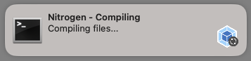
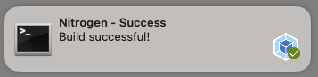

# Vite Build Notifier

A [Vite](https://vitejs.dev/) plugin that uses the [node-notifier](https://github.com/mikaelbr/node-notifier) package to display OS-level notifications for Webpack build events.

**vite-build-notifier** can generate notifications for compilation errors, as well as notify you when the compilation process is triggered and completes successfully.

[](https://travis-ci.com/RoccoC/webpack-build-notifier)




## Install

```shell
npm i --save-dev @brokenice/vite-build-notifier
```

## Usage
add blow codes to `vite.config.js`

```js
import ViteBuildNotifierPlugin from "@brokenice/vite-build-notifier"
export default defineConfig({
  plugins: [ViteBuildNotifierPlugin()]
});
```

##Options

```js
import ViteBuildNotifierPlugin from "@brokenice/vite-build-notifier"
export default defineConfig({
  plugins: [ViteBuildNotifierPlugin(
      options, // exe. {title: 'test', message: 'new message'}
      suppressOnStart,
      suppressSound,
      onStart,
      onEnd
  )]
});
```

exe. with no sounds:

```js
import ViteBuildNotifierPlugin from "@brokenice/vite-build-notifier"
export default defineConfig({
  plugins: [ViteBuildNotifierPlugin(null,false,true)]
});

Config Options
--------------

#### options
You can refer to node-notifier options 

#### onStart
A function which is invoked when compilation starts. Optional. The function has no paramters.

#### onEnd
A function which is invoked when compilation completes. Optional. The function is passed one parameter:
* {Error} containing compilation error

#### suppressOnStart
Disable notifications when a new compile process starts.

#### suppressSound
Suppress sounds


Todo
--------------

- Add support for warnings 
